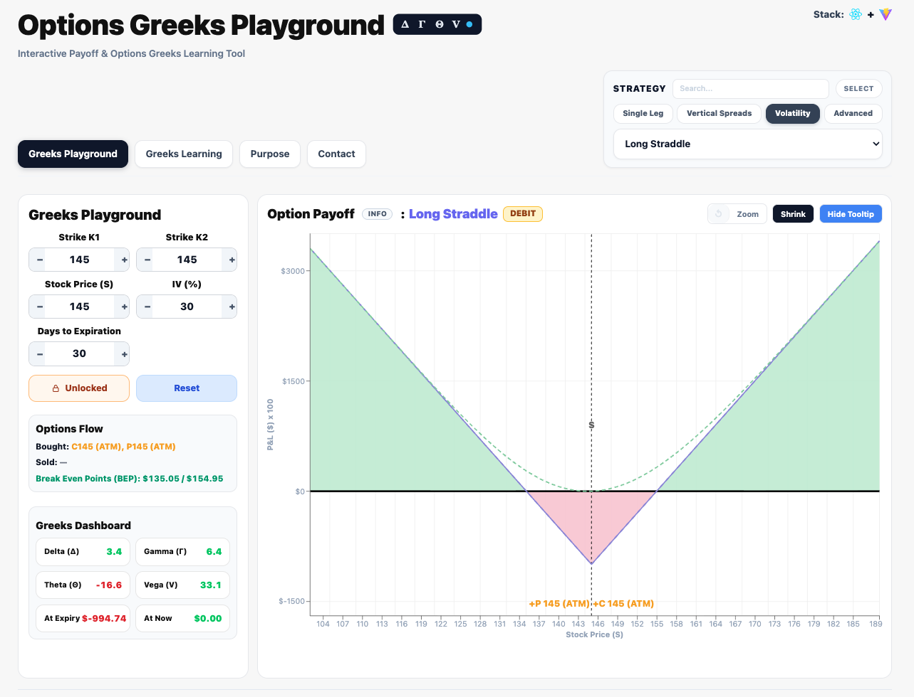
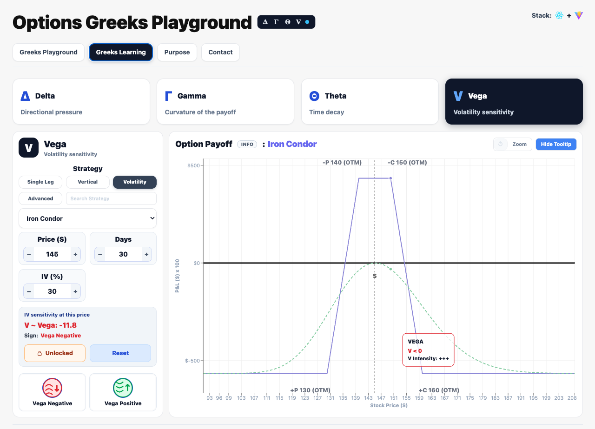
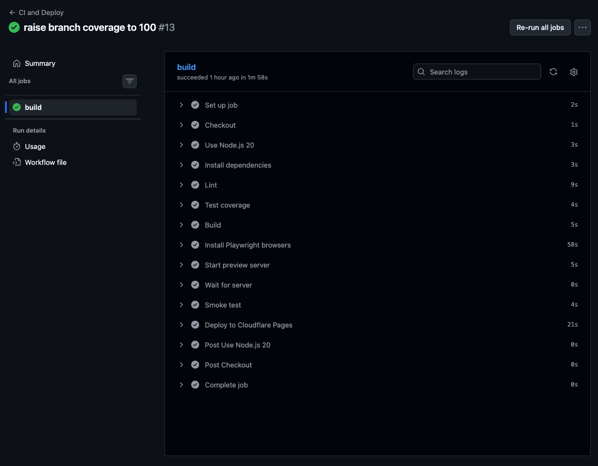
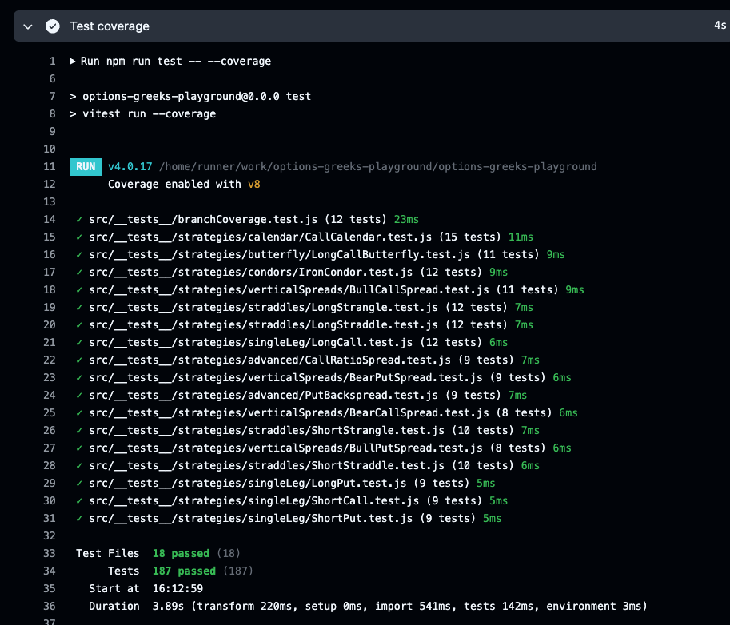

<h1>Options Greeks Playground</h1>
Showcase for options Greeks (Delta, Gamma, Vega, Theta) with concise docs and examples.

Live site: https://greeksplayground.com/

## Quick View

- Purpose: learn options Greeks through interactive, real time visuals
- Stack: React + Vite, ESLint, Vitest, Playwright, GitHub Actions, Cloudflare Pages

### Greeks Playground

Study strategies safely and explore payoffs in a sandbox. Use Search to find a strategy fast, or click Select (top right) and open the dropdown to browse all available strategies. More strategies will be added over time.

  

### Greeks Learning

Interactive visuals for Delta, Gamma, Vega, and Theta so you can see how each Greek behaves and changes with inputs.

  

## Tech Stack

<table>
  <thead>
    <tr>
      <th align="left">Layer</th>
      <th align="left">Technology</th>
      <th align="left">Purpose</th>
    </tr>
  </thead>
  <tbody>
    <tr>
      <td>UI</td>
      <td> React</td>
      <td>Interactive single page interface</td>
    </tr>
    <tr>
      <td>Build</td>
      <td> Vite</td>
      <td>Fast dev server and production builds</td>
    </tr>
    <tr>
      <td>Lint</td>
      <td> ESLint</td>
      <td>Code quality checks</td>
    </tr>
    <tr>
      <td>Unit Tests</td>
      <td> Vitest</td>
      <td>Fast unit testing</td>
    </tr>
    <tr>
      <td>E2E Tests</td>
      <td> Playwright</td>
      <td>Browser smoke coverage</td>
    </tr>
    <tr>
      <td>CI/CD</td>
      <td> GitHub Actions</td>
      <td>Automated pipeline</td>
    </tr>
    <tr>
      <td>Hosting</td>
      <td> Cloudflare Pages</td>
      <td>Static site hosting</td>
    </tr>
  </tbody>
</table>

## Highlights

- Instant feedback loop for payoff curves and Greeks
- Focused learning flow without distractions
- CI/CD with lint, tests, coverage, build, and smoke checks

## CI/CD and Quality

GitHub Actions runs linting, unit tests, coverage, build, and smoke tests before deploy.

  

  

  

  

CI pipeline tasks:
- Linting
- Unit tests
- Coverage tests
- Build
- Smoke tests (basic load + title check)

## Overview

Options Greeks Playground is an interactive web app that helps traders and learners build intuition about options Greeks and payoff dynamics. The experience is intentionally fast, visual, and hands on: change inputs and see the consequences immediately.

## Product Scope

- Greeks Playground: interactive controls with real-time payoff and Greeks
- Greeks Learning: focused explanations and learning flow
- Value Proposition: project goals and context

## User Experience

- Fast iteration: every control change updates charts and Greeks instantly
- Minimal friction: clear layout, direct controls, no forced signup
- Guided clarity: learning section complements the playground

## Visual System

- Layout: clean, centered content with strong hierarchy
- Typography: bold headings + readable body text
- Color: high contrast for data visibility and quick scanning
- Components: dashboards, charts, strategy selectors, input controls

## Architecture

- Client rendered React app
- Vite for dev speed and production builds
- No server side rendering in the current stack

## Hosting

- Static site deployed to Cloudflare Pages
- Preview deployments for each PR

## Roadmap

- Add more strategy presets
- Expand learning content with examples
- Performance budgets and monitoring
