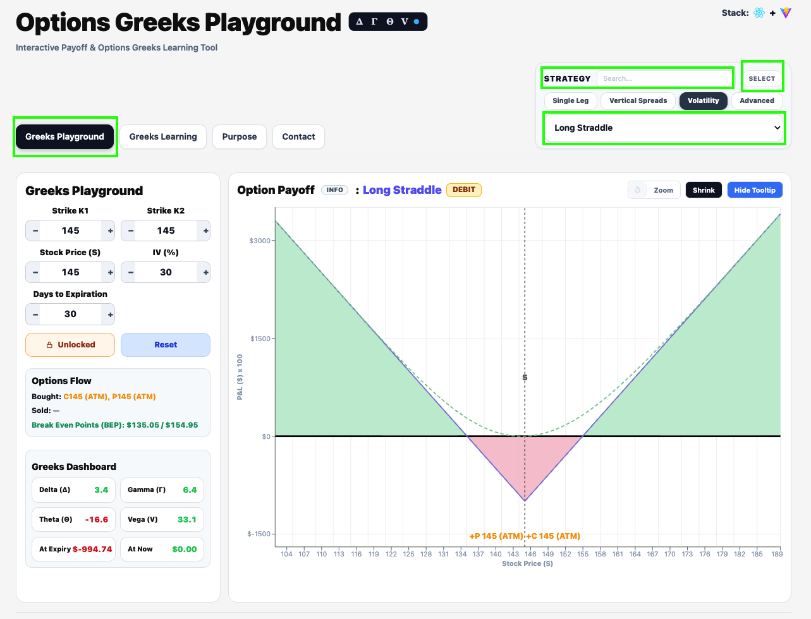
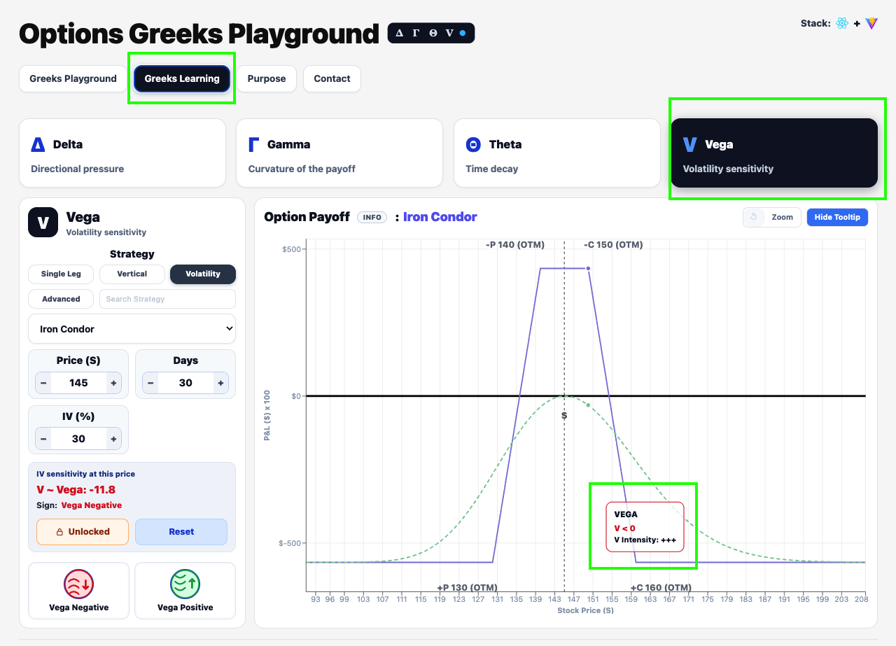
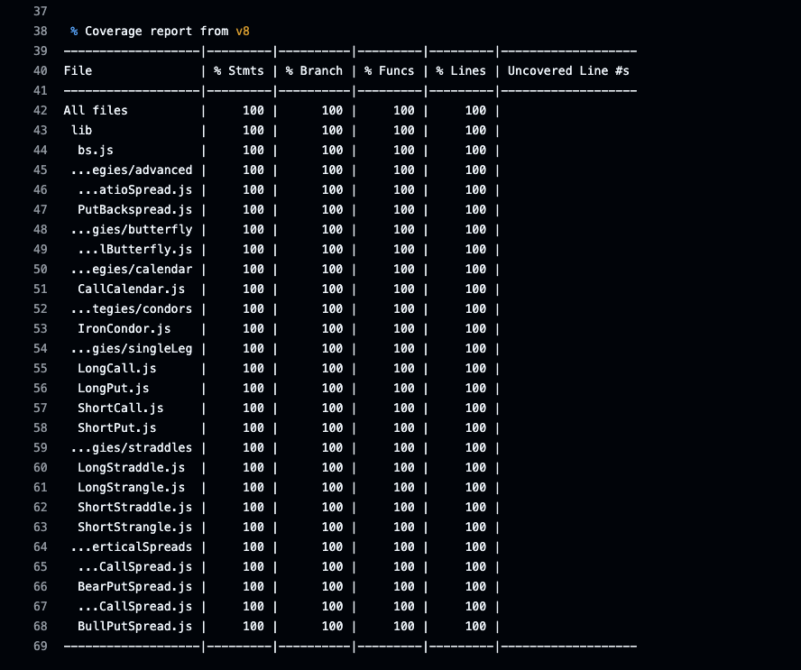

<h1>Options Greeks Playground</h1>
Showcase for options Greeks (Delta, Gamma, Vega, Theta) with concise docs and examples.

Live site: https://greeksplayground.com/

## Quick View

- Purpose: learn options Greeks through interactive, real time visuals
- Stack: React + Vite, ESLint, Vitest, Playwright, GitHub Actions, Cloudflare Pages
- Options Greeks Playground is an interactive web app that helps traders and learners build intuition about options Greeks and payoff dynamics. The experience is intentionally fast, visual, and hands on: change inputs and see the consequences immediately.

### Greeks Playground

Study strategies safely and explore payoffs in a sandbox. Use Search to find a strategy fast, or click Select (top right) and open the dropdown to browse all available strategies. More strategies will be added over time.

  

### Greeks Learning

Interactive visuals for Delta, Gamma, Vega, and Theta so you can see how each Greek behaves and changes with inputs.

  

## Tech Stack

<table>
  <thead>
    <tr>
      <th align="left">Layer</th>
      <th align="left">Technology</th>
      <th align="left">Purpose</th>
    </tr>
  </thead>
  <tbody>
    <tr>
      <td>UI</td>
      <td> React</td>
      <td>Interactive single page interface</td>
    </tr>
    <tr>
      <td>Build</td>
      <td> Vite</td>
      <td>Fast dev server and production builds</td>
    </tr>
    <tr>
      <td>Lint</td>
      <td> ESLint</td>
      <td>Code quality checks</td>
    </tr>
    <tr>
      <td>Unit Tests</td>
      <td> Vitest</td>
      <td>Fast unit testing</td>
    </tr>
    <tr>
      <td>E2E Tests</td>
      <td> Playwright</td>
      <td>Browser smoke coverage</td>
    </tr>
    <tr>
      <td>CI/CD</td>
      <td> GitHub Actions</td>
      <td>Automated pipeline</td>
    </tr>
    <tr>
      <td>Hosting</td>
      <td> Cloudflare Pages</td>
      <td>Static site hosting</td>
    </tr>
  </tbody>
</table>

## Highlights

- Instant feedback loop for payoff curves and Greeks
- Focused learning flow without distractions
- CI/CD with lint, tests, coverage, build, and smoke checks

## CI/CD and Quality

GitHub Actions runs linting, unit tests, coverage, build, and smoke tests before deploy.

Workflow runs (recent commits):

  

Build and deploy pipeline steps:

  

Unit tests running now:

  

Test coverage summary:

  

CI pipeline tasks:
- Linting
- Unit tests
- Coverage tests
- Build
- Smoke tests (basic load + title check)

## Architecture

- Client rendered React app
- Vite for dev speed and production builds
- No server side rendering in the current stack

## Hosting

- Static site deployed to Cloudflare Pages
- Preview deployments for each PR

## Roadmap

- Add more strategy presets
- Expand learning content with examples
- Performance budgets and monitoring
